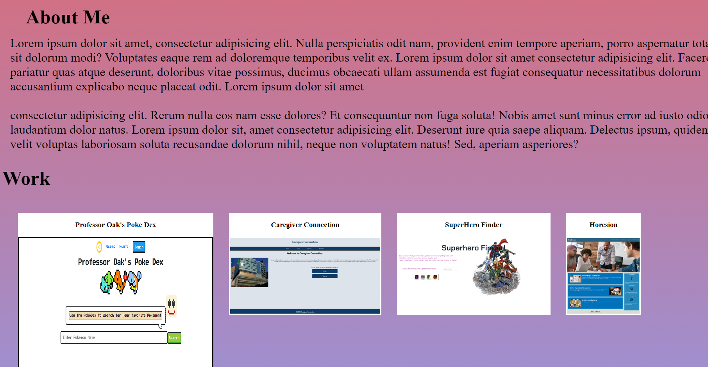

# portfolio

## Description 
This is my mock up of my portfolio. 
I tired to incorperate flex boxes to move the images around in my work section. I couldn't get the page to be responsive how I would like. But, in practice I will be able to make my website more responsive. The work as all links to my pass projects and deployed sites. This assignemt focuses heavy on HTML format as well as advance CSS to make pages more responsive in webapp development. Also all links should work if you need to contact me you are able to click on them in my portfolio.

## User Story
```md
AS AN employer
I WANT to view a potential employee's deployed portfolio of work samples
SO THAT I can review samples of their work and assess whether they're a good candidate for an open position
```
## Acceptance Criteria
```md
GIVEN I need to sample a potential employee's previous work
WHEN I load their portfolio
THEN I am presented with the developer's name, a recent photo or avatar, and links to sections about them, their work, and how to contact them
WHEN I click one of the links in the navigation
THEN the UI scrolls to the corresponding section
WHEN I click on the link to the section about their work
THEN the UI scrolls to a section with titled images of the developer's applications
WHEN I am presented with the developer's first application
THEN that application's image should be larger in size than the others
WHEN I click on the images of the applications
THEN I am taken to that deployed application
WHEN I resize the page or view the site on various screens and devices
THEN I am presented with a responsive layout that adapts to my viewport
```

## ScreenShot


## Link
https://jonnvoo.github.io/portfolio/ 


